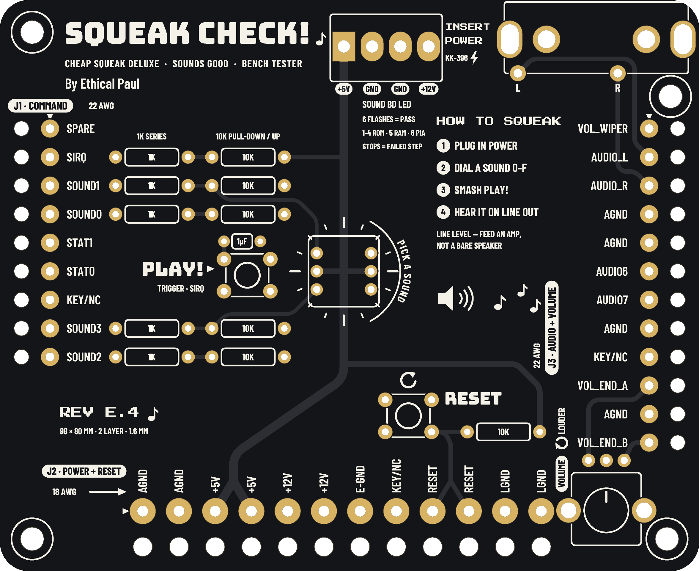

# Squeak Check!

A bench tester for Midway's Cheap Squeak Deluxe, Sounds Good and Turbo Cheap Squeak arcade sound boards (Spy Hunter, Rampage, Xenophobe, Sarge and more). Power a sound board on the bench, dial a sound 0–F, press PLAY, and hear it on line out, with no game CPU board, harness or cabinet.

By Ethical Paul.

**Website:** the full write-up (how the boards work, pinouts, hook-up diagram, history) is in `index.html`, published with GitHub Pages.

## Files

| Path | What it is |
| --- | --- |
| `fab/SqueakCheck_RevE4_Gerbers.zip` | Gerbers and drill files, Rev E.4 (98 × 80 mm, 2 layers, 1.6 mm) |
| `fab/BOM.csv` | Bill of materials with Mouser part numbers |
| `fab/Harness_Pin_Map.csv` | Every harness hole: connector, pin, label, net, position |
| `fab/README.txt` | Revision history and verification notes |
| `index.html`, `images/` | The website |

## Ordering boards

Upload the Gerber zip to any 2-layer PCB fab: FR-4, 1.6 mm, 1 oz copper, any mask colour, white silk, HASL or ENIG.

## Rights

© 2026 Ethical Paul. All rights reserved. No license is granted yet; ask before reusing the files.
